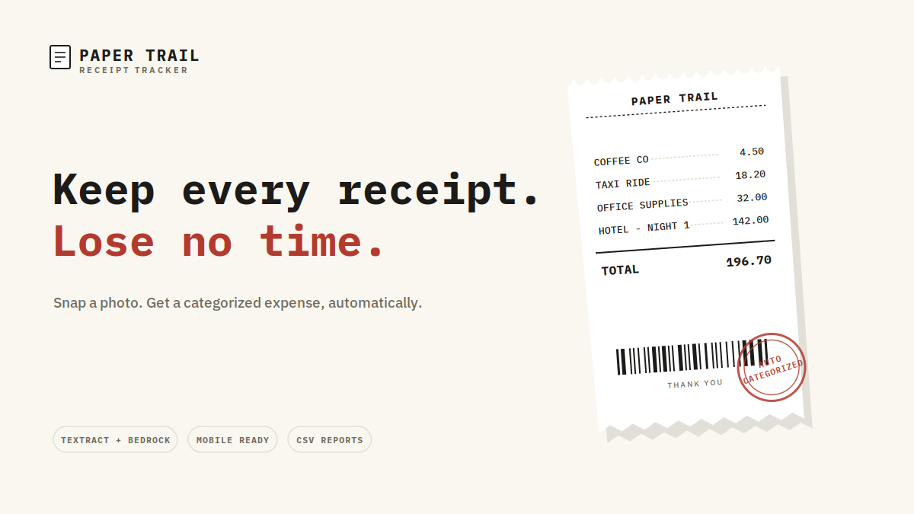
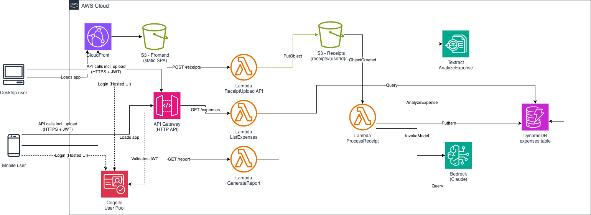

# 🧾 Paper Trail

A serverless, mobile-friendly receipt tracker built on AWS. Take a photo of a receipt (or upload any file type), and it turns itself into a categorized expense, ready for a CSV report at month-end or financial year-end.

Built as part of the AWS Weekend Productivity Challenge.



---

## What it does

- **Sign in** through Cognito Hosted UI (Authorization Code + PKCE, no client secret).
- **Upload a receipt**, any file type, by camera capture on mobile or file picker on desktop.
- Behind the scenes: **Textract** extracts the raw fields from the receipt, and **Bedrock (Claude)** normalizes them into a clean merchant, amount, currency, date, and category.
- **Browse expenses** in a running list with a total.
- **Download a CSV report** for the current month or current financial year with one tap, or a custom date range for anything else.

No manual data entry, no spreadsheet wrangling. Defaults to AUD ($), with per-receipt currency detection.

## Architecture

**Everything sits behind one Cognito-authenticated API.** Every route, receipt upload included, requires a valid JWT from the same Cognito User Pool.



```
User → CloudFront → S3 (static frontend)
User → Cognito Hosted UI (login)
User → API Gateway (JWT-authorized, single API)
         ├─ POST /receipts → Lambda (ReceiptUpload) → S3 (receipts bucket)
         │                                                  │
         │                                     S3 ObjectCreated event
         │                                                  ▼
         │                                   Lambda (ProcessReceipt)
         │                                       ├─ Textract AnalyzeExpense
         │                                       ├─ Bedrock InvokeModel (Claude)
         │                                       └─ DynamoDB PutItem
         ├─ GET  /expenses → Lambda (ListExpenses)  → DynamoDB Query
         └─ GET  /report   → Lambda (GenerateReport) → DynamoDB Query → CSV
```

### AWS services used

| Service | Purpose |
|---|---|
| Amazon Cognito | User authentication (Hosted UI, JWT issuance) for the frontend and every API route |
| Amazon S3 | Static frontend hosting + receipt storage |
| Amazon CloudFront | HTTPS delivery of the frontend |
| Amazon API Gateway (HTTP API) | One JWT-authorized REST API for upload, listing, and reporting |
| AWS Lambda | Upload handling, receipt processing, expense queries, CSV generation |
| Amazon Textract | `AnalyzeExpense` OCR extraction from the receipt image |
| Amazon Bedrock | Claude normalizes Textract's output into structured fields |
| Amazon DynamoDB | Stores each expense, keyed by user and date |

All infrastructure is defined in a single CloudFormation template, no servers to patch or scale.

## Repo structure

```
.
├── receipt-tracker-infra.yaml   # CloudFormation template (all AWS resources)
├── index.html                   # Static frontend (no build step required)
└── docs/
    ├── banner.png
    └── architecture.png
```

## Prerequisites

- An AWS account with the AWS CLI configured
- [Model access](https://docs.aws.amazon.com/bedrock/latest/userguide/model-access.html) enabled in the Bedrock console for the model you'll use (default: `anthropic.claude-3-5-sonnet-20241022-v2:0`)

## Deploy

```bash
aws cloudformation deploy \
  --template-file receipt-tracker-infra.yaml \
  --stack-name receipt-tracker \
  --capabilities CAPABILITY_IAM \
  --parameter-overrides \
      CognitoDomainPrefix=your-unique-prefix \
      FinancialYearStartMonth=7
```

`CognitoDomainPrefix` must be globally unique across all AWS accounts (it becomes `https://<prefix>.auth.<region>.amazoncognito.com`). `FinancialYearStartMonth` defaults to `7` (July, matching the Australian financial year); set it to `4` for UK-style, or `1` for a calendar-year financial year.

Grab the outputs you'll need for the frontend:

```bash
aws cloudformation describe-stacks \
  --stack-name receipt-tracker \
  --query 'Stacks[0].Outputs' \
  --output table
```

## Configure and deploy the frontend

Open `index.html` and fill in the `CONFIG` object near the top of the `<script>` tag with the stack outputs:

```js
const CONFIG = {
  userPoolClientId: '...',       // Output: UserPoolClientId
  cognitoHostedUiDomain: '...',  // Output: CognitoHostedUiDomain
  apiEndpoint: '...',            // Output: ApiEndpoint
  financialYearStartMonth: 7     // must match the FinancialYearStartMonth parameter above
};
```

Then upload it to the frontend bucket and invalidate CloudFront:

```bash
aws s3 cp index.html s3://<FrontendBucketName>/index.html

aws cloudfront create-invalidation \
  --distribution-id <your-distribution-id> \
  --paths "/*"
```

`FrontendBucketName` is also in the stack outputs. The CloudFront distribution ID can be found with:

```bash
aws cloudfront list-distributions \
  --query "DistributionList.Items[?Origins.Items[0].DomainName=='<FrontendBucketName>.s3.<region>.amazonaws.com'].Id" \
  --output text
```

## API reference

All routes require `Authorization: Bearer <Cognito ID token>` and are authorized by the same JWT authorizer, there is no separate or unauthenticated path for uploads.

| Method | Path | Description |
|---|---|---|
| `POST` | `/receipts` | Upload a receipt. Body: `{ "filename": "...", "contentType": "...", "fileBase64": "..." }`. Any file type is accepted; max 5MB decoded. |
| `GET` | `/expenses` | List all expenses for the signed-in user. Optional `?start=YYYY-MM-DD&end=YYYY-MM-DD` to filter a range. |
| `GET` | `/report?period=month&value=YYYY-MM` | Download a CSV for a given month. |
| `GET` | `/report?period=financial_year&value=YYYY` | Download a CSV for the financial year starting in `YYYY`. |
| `GET` | `/report?period=custom&start=YYYY-MM-DD&end=YYYY-MM-DD` | Download a CSV for a custom range. |

## How receipt processing works

1. `ReceiptUploadFunction` decodes the base64 file from the request, resolves a file extension from the filename or MIME type, and writes it to `s3://<receipts-bucket>/receipts/{userId}/{receiptId}.{ext}`.
2. That S3 write triggers `ProcessReceiptFunction`, which:
   - Runs Textract's `AnalyzeExpense` to pull structured fields off the receipt.
   - Sends those fields to Bedrock (Claude) with a prompt asking for merchant, amount, currency, date, and category as JSON.
   - Recovers valid JSON from the model's response even if it's wrapped in markdown code fences or has stray text around it.
   - Normalizes whatever date comes back into a strict `YYYY-MM-DD` format (Bedrock doesn't always follow the requested format exactly, and an inconsistent format silently breaks date-range queries).
   - Writes the result to DynamoDB. Failures on an individual receipt are logged and isolated, they don't fail the whole batch.

All of this is structured-logged to CloudWatch (`LOG_LEVEL` env var on the function, default `INFO`) for debugging.

## Known issues / TODO

- No automated tests yet. Contributions welcome.
- No token refresh: the Cognito ID token expires in 1 hour, at which point the app requires signing in again rather than silently refreshing.
- The 5MB upload limit is set to stay well under the 6MB Lambda proxy-integration payload limit (base64 adds ~33% overhead on top of the raw file). Large PDFs or high-resolution photos may need client-side compression first.

## License

MIT, or your license of choice, update this section before publishing.
